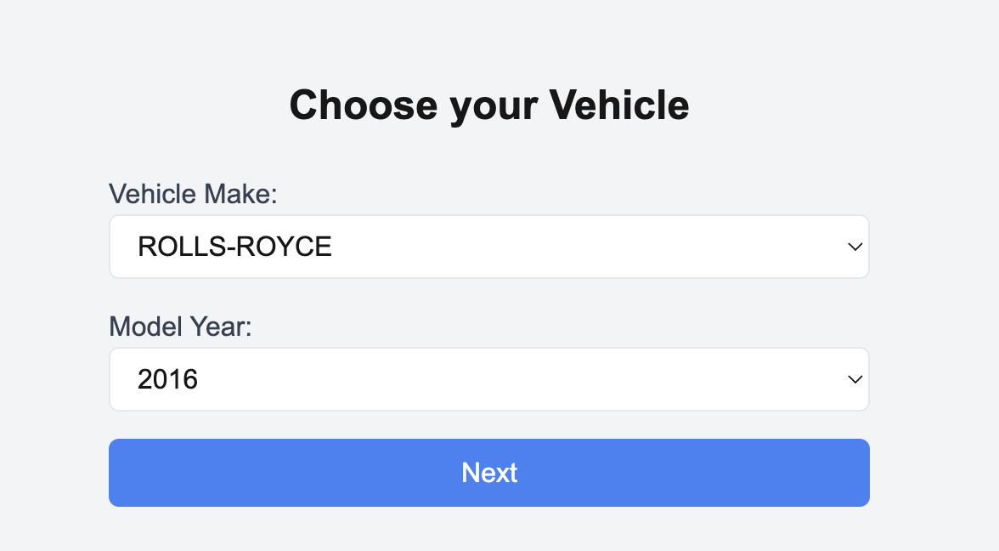
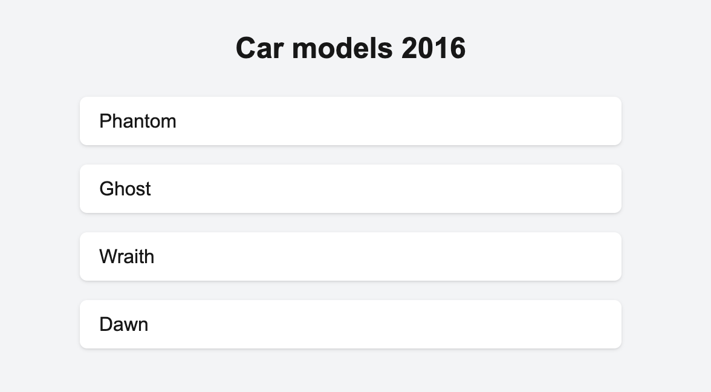

### VIDEO PRESENTATION
https://www.loom.com/share/221184fafc874fe5b3df01f756c04151?sid=b25ea90c-3e07-460c-b2d0-6b9d24f1c899

### :fire:THE CAR DEALER APP:fire:

In this app you can select vehicle make, model year and see all relevant vehicles

P.S I had problems with the generateStaticParams function and I had to make a quick decision to meet the deadline, and I changed versions Next.js and React. Because of this, Tailwind stopped applying styles. But I found a way out of this situation, I replaced Tailwind with Bulma, the libraries are different, but the principle is the same.

### TECH STACK

-   Next.js
-   Bulma
-   Eslint
-   Prettier

### Features

-   **Vehicle Make Selection**: Users can choose from a list of vehicle makes.
-   **Model Year Selection**: Users can select a model year from 2015 to the current year.
-   **Dynamic Model Display**: The application fetches and displays car models based on the selected make and year.
-   **Responsive Design**: The application is designed to be mobile-friendly and accessible on various devices.
-   **Loading Indicator**: A loading indicator is displayed while data is being fetched to enhance user experience.
-   **Back Navigation**: Users can easily navigate back to the previous page.

### Architecture

-   **Frontend**: Built with React and Next.js, utilizing modern hooks and components to manage state and handle user interactions.
-   **Client-Side Rendering**: Utilizes client-side components to handle interactivity and dynamic data fetching.
-   **Server-Side Rendering**: Pre-generates static pages for each vehicle make and model year combination using Next.js' static generation features.
-   **API Integration**: Fetches data from external APIs to populate vehicle makes and models.

## Getting Started

To get started with the Car Dealer Application, follow the instructions below:

### Prerequisites

-   Node.js (version 14 or higher)
-   npm (Node Package Manager)

### Installation

1. Clone the repository to your local machine:

    - git clone <repository-url>
    - cd car-dealer-app

2. Install the dependencies:

    - npm install

3. Building the Application

    - npm run build

4. Running the Application
    - npm run dev

**PREVIEW**

**SEE YOU ON THE INTERVIEW :wink:**
